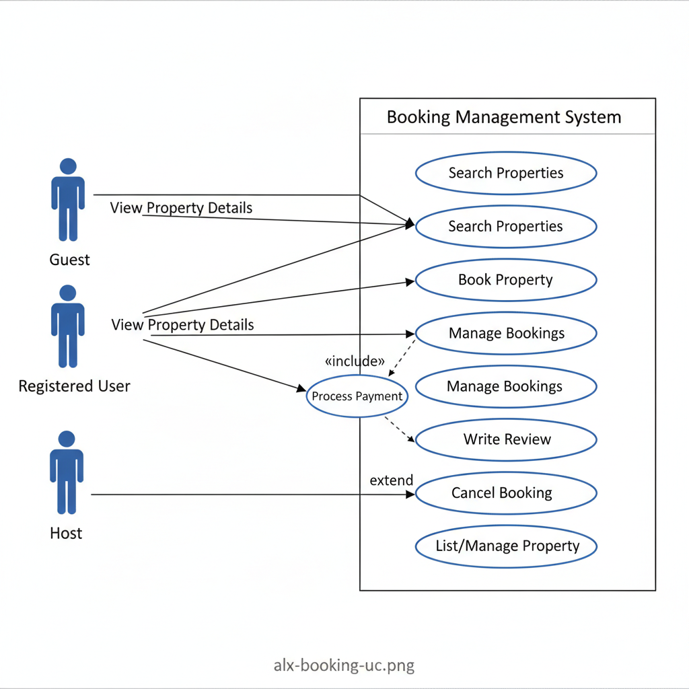

# Requirement Analysis in Software Development
The Requirement Analysis Project focuses on crafting a comprehensive foundation for software development by documenting, analyzing, and structuring requirements.

## What is Requirement Analysis?
Requirement Analysis is a critical phase in the Software Development Lifecycle (SDLC) where the project team systematically gathers, analyzes, defines, and validates all the needs and constraints of the final software product. Think of it as creating the blueprint for a house before laying a single brick.

This process ensures that all stakeholders (users, customers, and developers) share a clear, mutual understanding of what the system must do (features) and how well it must perform (quality attributes).

## Why is Requirement Analysis Important?

Requirement Analysis is **critical** in the Software Development Lifecycle (SDLC) because it lays the necessary groundwork for a successful, on-budget, and high-quality project. Failure to perform this analysis effectively is a leading cause of project failure and rework.

***

### 1. Defines and Manages Project Scope 📐
Requirement Analysis clearly defines the **boundaries** of the project, establishing exactly what the system will and will not do.
* **Prevents Scope Creep:** By having a documented and approved scope, the team can resist the addition of unplanned features, which are the main cause of budget overruns and schedule delays.
* **Focuses Resources:** It ensures that development efforts and resources are concentrated only on the agreed-upon features and functionalities that deliver the most value to the stakeholders.

### 2. Reduces Cost and Rework (Risk Mitigation) 📉
Identifying errors or misunderstandings during the requirements phase is significantly **cheaper and faster** than fixing them later.
* **Early Error Detection:** Ambiguities or flaws in requirements are caught before costly design and coding work begins.
* **Minimizes Redesign:** A change requested during the coding or testing phase can require substantial rework on design, code, and documentation. Clear requirements minimize the need to tear down and rebuild parts of the system.

### 3. Basis for Quality Assurance and Validation ✅
The documented requirements serve as the ultimate **source of truth** for testing and validating the final product.
* **Testing Benchmark:** Every requirement (both functional and non-functional) translates directly into a **test case**. This ensures that the system is thoroughly tested against the customer's exact expectations.
* **Customer Satisfaction:** By ensuring the final system meets all the specified requirements (using **Acceptance Criteria**), the process guarantees the product is built correctly and, more importantly, that it is the **right product** that satisfies the end-user's needs.

## Key Activities in Requirement Analysis

Requirement Analysis is a structured process involving five major activities to ensure that all necessary information is captured, understood, and agreed upon before development begins.

***

### 1. Requirement Gathering 🗂️
This is the initial step of collecting information from stakeholders about their needs and expectations for the system. The goal is to cast a wide net to capture all potential requirements.

* **Interviews:** Conducting one-on-one sessions with key stakeholders (users, managers, experts) to understand their detailed needs.
* **Surveys/Questionnaires:** Distributing forms to a large audience to collect requirements efficiently and broadly.
* **Observation:** Watching end-users perform their current tasks to identify implicit needs or problems the users may not articulate.
* **Document Analysis:** Reviewing existing system manuals, business policies, and procedural documents to understand current functionalities.

### 2. Requirement Elicitation ✍️
Once requirements are gathered, this activity focuses on refining, elaborating, and understanding the deeper 'why' behind the needs. It involves creative and collaborative techniques.

* **Brainstorming:** Group sessions to generate and share ideas, especially for new or innovative features.
* **Focus Groups:** Discussions with a select group of typical users to gather detailed feedback on a specific requirement or feature set.
* **Prototyping:** Creating simple, working models of the system interface to help stakeholders visualize the concept and provide concrete feedback for refinement.

### 3. Requirement Documentation 📚
This is the formal process of recording all requirements in a clear, consistent, and structured format, making them an official reference for the entire project.

* **Requirement Specification Document:** A comprehensive document detailing all **functional** (what the system does) and **non-functional** (how well the system performs) requirements.
* **User Stories:** Writing requirements from the user's perspective, typically in the format: "As a **\[type of user]**, I want to **\[goal]** so that **\[reason/benefit]**."
* **Use Cases:** Documenting sequences of actions between a user and the system to achieve a specific goal, often accompanied by diagrams.

### 4. Requirement Analysis and Modeling 📊
This activity involves scrutinizing the documented requirements to resolve conflicts, prioritize them, and visualize the system's structure.

* **Requirement Prioritization:** Ranking requirements based on urgency, business value, risk, and feasibility (e.g., using MoSCoW: Must have, Should have, Could have, Won't have).
* **Feasibility Analysis:** Assessing requirements from technical, operational, and financial standpoints to ensure they can be realistically implemented.
* **Modeling:** Creating visual diagrams (like Data Flow Diagrams, Entity-Relationship Diagrams, or system architecture models) to better understand and communicate complex requirements.

### 5. Requirement Validation ✅
The final step is to formally review and confirm that the documented requirements are correct, complete, unambiguous, and meet the needs of all stakeholders.

* **Review and Approval:** Meeting with stakeholders to present the documented requirements and obtain formal sign-off (approval).
* **Acceptance Criteria Definition:** Specifying the measurable conditions a feature must meet to be accepted by the customer upon delivery.
* **Traceability:** Establishing links between each requirement and its source, design, code, and test cases to ensure no requirement is missed during development or testing.

## Types of Requirements

Requirements are fundamentally categorized into two types, which describe what the system does and how well it does it. Both are crucial for defining the scope of a booking management project.

***

### 1. Functional Requirements ⚙️

**Definition:** Functional requirements specify **what the system must do**—the core actions, processes, and features that the user interacts with to achieve their goals.

**Examples for a Booking Management Project (like Airbnb/OYO):**

* **Search and Filter:** Users must be able to search for properties based on location, dates, price range, and property type (e.g., apartment, hotel, cabin).
* **Property Listing and Details:** The system must display a list of available properties, including high-resolution images, detailed descriptions, amenities, and host contact information.
* **Booking Management:** Users must be able to select available dates, confirm a reservation, and receive a booking confirmation email.
* **User Authentication:** The system must allow new users to register an account and existing users to log in securely (e.g., via email and password or social login).
* **Payment Processing:** The system must integrate with a third-party service (like Stripe or PayPal) to securely process payments and issue refunds.
* **Host Management:** Hosts must have a separate dashboard to list new properties, manage their calendar availability, and update pricing.

### 2. Non-functional Requirements 🛡️

**Definition:** Non-functional requirements (or **quality attributes**) specify **how the system performs**—they describe the operational characteristics and quality constraints of the software.

**Examples for a Booking Management Project (like Airbnb/OYO):**

* **Performance:**
    * **Response Time:** Search results must load within **2 seconds**, even with concurrent user traffic.
    * **Scalability:** The system must be able to handle a surge of up to **10,000 concurrent users** during peak holiday seasons without degradation in performance.
* **Security:**
    * **Data Encryption:** All user data, including personal details and payment information, must be encrypted both in transit (using HTTPS/SSL) and at rest.
    * **Authentication:** The system must enforce strong password policies and use Multi-Factor Authentication (MFA) for hosts.
* **Usability:**
    * **User Interface (UI/UX):** The mobile application must have an **intuitive interface** that allows a first-time user to complete a booking in five steps or less.
* **Reliability:**
    * **Uptime:** The system must maintain an uptime of **99.9%** (less than 9 hours of downtime per year).
    * **Data Consistency:** The booking system must prevent **double-booking** (concurrent requests for the same property on the same date) by using transactional mechanisms.

## Use Case Diagrams 📊
### What are Use Case Diagrams?

Use Case Diagrams are a powerful visual modeling tool used in software engineering to represent the functional requirements of a system. They illustrate how different users (called Actors) interact with the system to achieve specific goals (called Use Cases). Essentially, they show what the system does from an external user's perspective, without detailing how these actions are performed internally.

A Use Case Diagram typically consists of:

- **Actors**: Represented by stick figures, these are entities (humans or other systems) that interact with the system.

- **Use Cases**: Represented by ovals, these are the high-level functionalities or services the system provides to an actor.

- **Relationships**: Lines connecting actors to use cases, indicating participation.

***

### Benefits of Use Case Diagrams:

- **Clear Visual Representation**: They provide an easy-to-understand graphical overview of system functionalities, making it accessible even to non-technical stakeholders.

- **Requirement Identification & Organization**: They help in identifying and structuring the main functions of a system, ensuring all critical user interactions are considered.

- **Improved Communication**: They serve as an excellent communication tool between stakeholders, business analysts, and the development team, fostering a shared understanding of system scope.

- **Basis for Test Cases**: Each use case can directly translate into a scenario for testing, ensuring that the system is built to meet specified user goals.

***

Here is a use case diagram for a Booking Management System:

## Acceptance Criteria ✅

**What are Acceptance Criteria?**

Acceptance Criteria (AC) are a set of conditions that a software feature must satisfy to be accepted by the users, stakeholders, or product owner. They define the **boundaries** of a requirement—what is included, what is not, and the specific pass/fail metrics. They essentially provide a clear, testable definition of "Done" for any given feature.

-----

### Importance in Requirement Analysis

Acceptance Criteria are a critical output of the **Requirement Validation** activity because they:

  * **Eliminate Ambiguity:** They transform a subjective requirement (e.g., "The checkout process should be fast") into an objective, measurable statement (e.g., "The transaction confirmation must display within 3 seconds").
  * **Set Clear Expectations:** They ensure that all parties—the business, the development team, and the testers—have a unified and explicit understanding of the desired functionality and quality before development begins.
  * **Guide Testing and Validation:** ACs serve as the foundation for creating **test cases**. Testers use them as a checklist to confirm that the feature behaves exactly as the stakeholders intended, thereby ensuring quality.
  * **Prevent Scope Disagreements:** When a feature is delivered, the ACs provide the final proof that the work is complete and meets the agreed-upon standards, preventing disputes about whether the feature is truly finished.

-----

### Example for the Checkout Feature

| Feature | Acceptance Criteria |
| :--- | :--- |
| **User Story:** As a Registered User, I want to securely pay for and confirm my booking so that I can successfully reserve the property. | **Given** the user is on the final checkout screen, **When** they click "Pay Now" with valid payment details, **Then** a secure payment token must be generated, and the user must be redirected to a "Booking Confirmed" page within **3 seconds**. |
| **Specific Conditions:** | <ul><li>The system must support major credit cards (Visa, MasterCard, Amex) and one digital wallet option (e.g., Apple Pay). </li><li>The system must immediately send a confirmation email with the booking reference number to the user's registered email address.</li><li>If the payment fails, the user must receive a clear error message explaining why (e.g., "Invalid card number," "Insufficient funds") and be given an option to re-enter details.</li><li>The system must reserve the property inventory for **15 minutes** once the user initiates the checkout process to prevent double-booking.</li></ul> |
